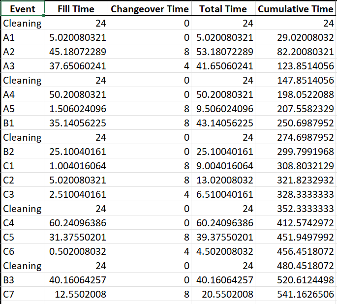
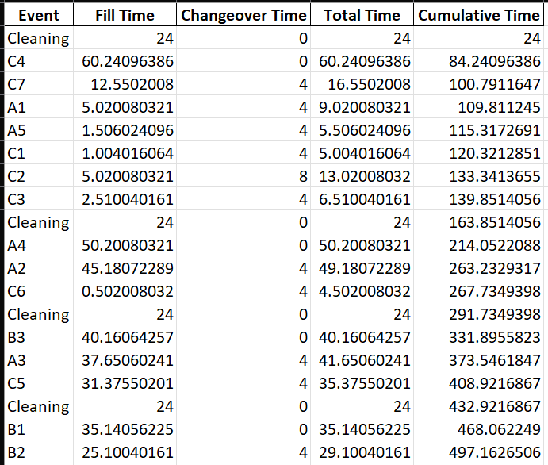
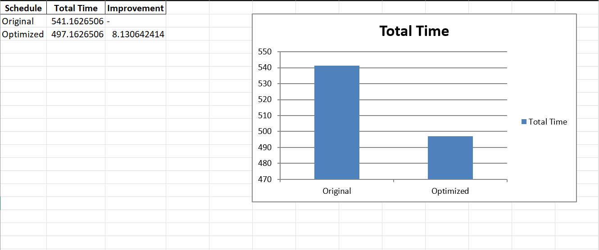

# Vial Fill Schedule Optimization

## Table of Contents

- [Packages](#1-packages)
- [Introduction](#2-introduction)
- [Constraints](#3-constraints)
- [Instructions](#4-instructions)
- [Thought Process](#5-thought-process)
- [Code Explanation](#6-code-explanation)
- [Possible Improvements](#7-possible-improvements)
- [Closing](#8-closing)

## 1.   Packages
The following packages are required to run:

- pandas
- openpyxl
- xlsxwriter

## 2.   Introduction

The purpose of this project was to create a filling schedule on a fill line that completes batches in the shortest amount of time and adheres by a set of constraints defined in [`/ChallengeConstraints.xlsx`](/ChallengeConstraints.xlsx).
The solution should take a sample data set consisting of batch IDs (lots) with batch types and a vial count and produce an optimized schedule with the goal of completing the fill process in the shortest time possible.

## 3.   Constraints

- Vials fill at a rate of 332 vials per minute
- Time between cleanings must never exceed 120 hours
- Cleanings take 24 hours
- Same batch type changeovers take 4 hours while different batch type changeovers take 8 hours
- Cleaning can not take place midway through a lot fill
- Changeovers done during cleaning do not add additional time to the 24-hour cleaning time
- Schedule always begins with an initial cleaning

## 4.   Instructions

1. Add dataset to test in input_data.xlsx file included. Do not change headers. The current dataset included
is the sample dataset that was provided with the challenge problem.
2. Run the fill-optimization.py script.
3. The python file generates an Excel spreadsheet that shows the original schedule provided, the optimized schedule, and a simple visual comparing the two and showing the percent improvement. All time is in hours.

### 4.1 Sample Input & Output Screenshots

## 4.   Constraints

- Vials fill at a rate of 332 vials per minute
- Time between cleanings must never exceed 120 hours
- Cleanings take 24 hours
- Same batch type changeovers take 4 hours while different batch type changeovers take 8 hours
- Cleaning can not take place midway through a lot fill
- Changeovers done during cleaning do not add additional time to the 24-hour cleaning time
- Schedule always begins with an initial cleaning

## 5.   Thought Process

- Vial fill times are absolute and cannot be improved
- The largest time hit that can be addressed with scheduling is the cleaning time (24 hours) and 
therefore minimizing the amount of cleanings that take place needs to be the priority. This can be done by using an
algorithm that attempts to fill in an order that gets as close to 120 hours without going over as possible so that
early cleanings aren't taking place.
- The second time hit to be addressed is reducing the number of changeovers to a different batch type thus limiting
the amount of 8 hour changeover times. This can be addressed by grouping lots with same batch types together.
- My implementation is based on a variation of the Bin Packing Problem (classic problem in operations research).
- My variation uses an algorithm similar to the First Fit Decreasing Algorithm, but it only focuses on one batch at
a time.

## 6.   Code Explanation

1. Import Excel dataset into python as a dataframe using pandas for manipulation and calculations
2. Add fill time (in hours) to dataframe
3. Add rows for initial cleaning and columns for changeover times, total time for that lot, and cumulative time
4. Insert rows for when cleanings take place and adjust the next row so there is no changeover time.
5. Run time calculations on original schedule
6. Create optimized dataframe from input_data
7. Repeat step 3 for optimized schedule, and then sort by vial fill time and batch type
8. While going through the "fill" on the optimized schedule, if the next batch will trigger a cleaning, skip it and go
to the next batch (which will be smaller due to the initial sort) and check if that can be filled without triggering
a cleaning. Continue this loop until no batches exist small enough to fit and then perform a cleaning. Do this until
all batches have been filled. The filled batches should be kept in a list as a holding place of the optimized order.
9. Compare total times for original vs optimized schedule
10. Export results to Excel spreadsheet showing original schedule, optimized schedule, and comparison visual.

## 7.   Possible Improvements

- Add the ability to match up different batch type changeovers with cleanings to limit the number of different type
changeovers
- Improve cleaning algorithm to try and get optimal groupings of lots that get as close to 120 as possible. Could use
some machine learning to accomplish this but would take time to research and would use more resources.
- A popular algorithm that could possibly improve total fill time would be the Best Fit Decreasing Algorithm (BFD) where
instead of skipping through batches in order of fill time descending and filling if it fits in the 120-hour window, I
would instead first calculate the total expected number of cleanings based on the total fill times which would give me
an approximate number of batch groups. Then I would us BFD to put batches in those groups based on which groupings would
leave the smallest leftover space between group fill time and 120 hours. But that would be much more complicated, harder
to implement, and take more computing power.

## 8.   Closing

This was a fun project in creating an optimization algorithm and provided good practical experience using pandas and working with dataframes.
